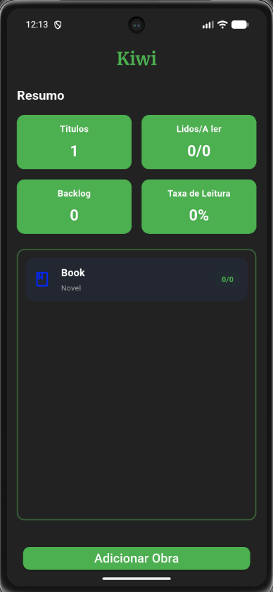
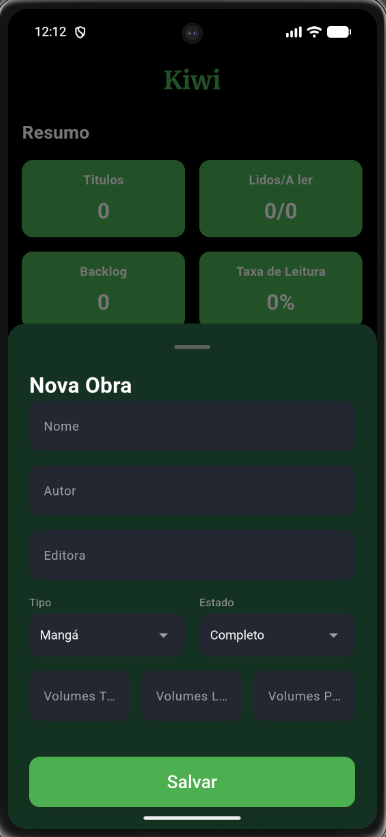

# 🥝 Projeto Kiwi

O **Kiwi** é um aplicativo mobile desenvolvido para o gerenciamento pessoal de coleções físicas e digitais de Mangás e Light Novels. O objetivo principal é manter o controle exato do acervo, monitorando o que já foi lido, o que está na estante e o tamanho do backlog atual.

Desenvolvido como um Produto Mínimo Viável (MVP), o aplicativo opera com foco em performance e funciona 100% offline, persistindo os dados na memória do próprio dispositivo.

  
  &nbsp;&nbsp;&nbsp;
  

## ✨ Funcionalidades Atuais

* **Dashboard Inteligente:** Painel superior que calcula automaticamente e em tempo real o total de títulos, proporção de lidos, backlog (volumes na estante não lidos) e taxa percentual de leitura.
* **Cadastro de Obras:** Formulário dinâmico (*Bottom Sheet*) com validação de dados e teclados numéricos adaptados para agilizar a entrada de novos volumes, com diferenciação visual entre Mangás e Light Novels.
* **Listagem Assíncrona:** Leitura do banco de dados sem travar a interface do usuário, utilizando `FutureBuilder`.
* **Exclusão Rápida:** Remoção de obras do banco de dados com recálculo instantâneo das estatísticas através de um gesto intuitivo de arrastar (*Swipe to Delete* / `Dismissible`).

## 🛠️ Tecnologias e Ferramentas

* **Linguagem:** Dart
* **Framework:** Flutter
* **Banco de Dados:** SQLite (via pacote `sqflite`)
* **Arquitetura de Dados:** Tabela única com ORM nativo construído manualmente (`toMap` e `fromMap`).

## 🚀 Próximos Passos (Roadmap Versão 2.0)

* [ ] Implementação de navegação para Tela de Detalhes dedicada por obra.
* [ ] Sistema de atualização rápida de leitura (botões incrementais para volumes lidos e comprados).
* [ ] Suporte para anexar e exibir a foto da capa de cada edição.

---
## 👨‍💻 Autor

**Infor**